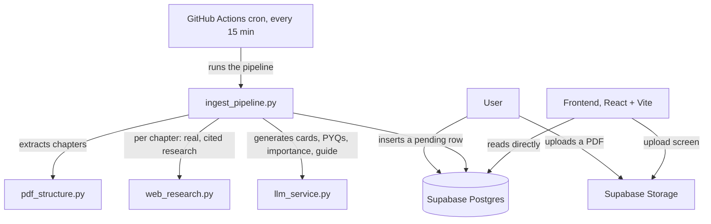

# UPSC ReelCastle

Turn NCERT textbooks into short, swipeable study cards and quizzes for UPSC
Civil Services aspirants — built to run at **zero ongoing cost**.

Upload a book PDF. An unattended backend pipeline extracts its chapters,
researches each one against real, reputable sources, and generates
exam-focused study cards, practice questions, an importance rating, and a
"how to approach this chapter" guide — every non-trivial claim traceable to
a real, stored source URL, never invented by the model. The frontend then
lets an aspirant browse: **Library → a book → a chapter → Study Cards or
Take Quiz**, with progress tracking and a gamified "Castle" view.

## How it works



- A **book** is split into chapters (embedded PDF outline → Contents-page
  parsing → in-body chapter-marker scan, whichever succeeds first).
- Each **chapter** gets its own research pass: an LLM first decides whether
  the topic actually needs current data (population stats, policy) or is a
  static concept/mechanism/history topic — then, only if it does, names the
  real government department that covers it (verified after the fact by a
  genuine `.gov.in`/`.nic.in`/`.res.in` domain, not a hardcoded list). A
  fixed, human-verified set of UPSC exam-analysis sites (Drishti, Vision IAS,
  InsightsOnIndia, Unacademy, and others) is always checked too, alongside
  Wikipedia for general background.
- An LLM turns the chapter's own text plus that research into **cards**,
  **practice questions**, an **importance rating**, and an **approach
  guide** — citing research only by number, never a raw URL, so a citation
  that ends up stored is always resolvable back to something the pipeline
  actually fetched.
- Once every chapter in a book is done, a book-level pass re-judges each
  chapter's importance *relative to the whole book* (so it isn't just "High"
  across the board) and writes an overall subject strategy guide, grounded
  in the same kind of real research.

See [`HANDOFF.md`](HANDOFF.md) for the full build log — what was tried, what
broke, why, and what's still open. That file is the detailed project
memory; this one is the front door.

## Project structure

```
backend/
  ingest_pipeline.py       orchestrator: claims a book, processes chapters, resumable
  llm_service.py            LLM calls (NVIDIA NIM -> OpenRouter fallback)
  seed_book.py               CLI to queue a book without the frontend
  services/
    pdf_structure.py         PDF -> chapter boundaries
    web_research.py           cited, allowlisted web research
    supabase_client.py        service-role Supabase client
  supabase_schema/schema.sql  DB schema + RLS policies (run manually in Supabase)

frontend/
  src/
    App.tsx                   screen state machine (no router, by design)
    utils/bookData.ts          every Supabase query lives here
    components/                Library -> Book -> Chapter -> Cards/Quiz -> Castle

.github/workflows/ingest-books.yml   cron-driven worker (every 15 min, 14 min job timeout)
```

## Tech stack

| | |
|---|---|
| Backend | Python, [PyMuPDF](https://pymupdf.readthedocs.io/), [Tesseract OCR](https://github.com/tesseract-ocr/tesseract) fallback, [`ddgs`](https://pypi.org/project/ddgs/) (keyless DuckDuckGo search) |
| LLM | [NVIDIA NIM](https://build.nvidia.com/) (primary, free), [OpenRouter](https://openrouter.ai/) free models (fallback) |
| Database / Storage | [Supabase](https://supabase.com/) (Postgres + Storage), Free plan |
| Scheduling | GitHub Actions cron, free minutes |
| Frontend | React 19 + Vite + Tailwind CSS 4, deployed on [Vercel](https://vercel.com/) Free plan |

Everything here is free-tier by design — that constraint shapes the
architecture (resumable, budget-limited pipeline runs; a self-throttled
research layer; a client-side upload cap matching Supabase's real ceiling)
and is treated as a real product decision, not a bug to route around.

## Getting started

### Backend (ingestion pipeline)

```bash
cd backend
pip install -r requirements.txt
```

Create `backend/.env` (never committed) with:

```
SUPABASE_URL=...
SUPABASE_SERVICE_ROLE_KEY=...
NVIDIA_API_KEY=...
OPENROUTER_API_KEY=...
```

Run the schema once against a fresh Supabase project (SQL editor —
`backend/supabase_schema/schema.sql` is idempotent, safe to re-run after
schema changes too), then create a Storage bucket named `book-uploads`
(Private).

Queue a book without the frontend:

```bash
python seed_book.py "../your-book.pdf" --title "Book Title" --subject Geography
```

Run one ingestion pass locally:

```bash
python ingest_pipeline.py
```

In production this runs automatically via
[`ingest-books.yml`](.github/workflows/ingest-books.yml) every 15 minutes —
each run processes what it can inside a ~10-minute self-imposed budget and
picks up where it left off next tick.

### Frontend

```bash
cd frontend
npm install
```

Create `frontend/.env` with:

```
VITE_SUPABASE_URL=...
VITE_SUPABASE_ANON_KEY=...
```

```bash
npm run dev
```

The frontend reads Supabase directly with the anon key — there's no backend
API server, and no authentication (the upload screen is intentionally the
only public write path, gated by a PDF-only + size-cap check at the Storage
level).

## Status

Actively developed — see [`HANDOFF.md`](HANDOFF.md) §5/§6 for open issues
and what's next.
